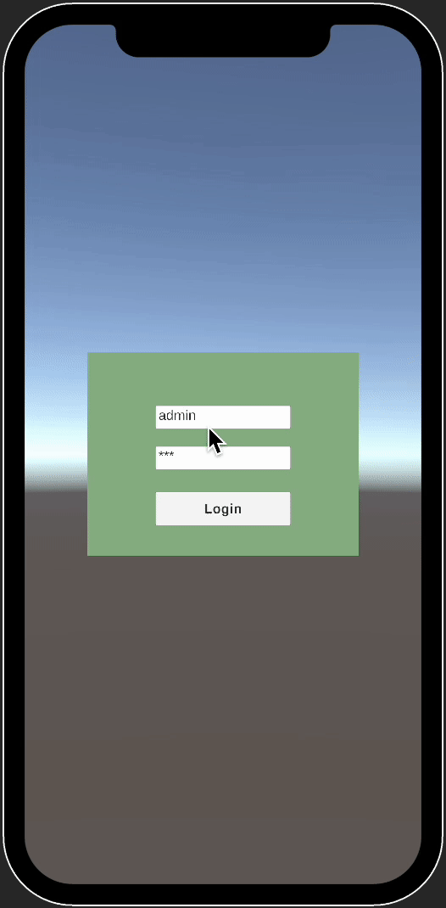
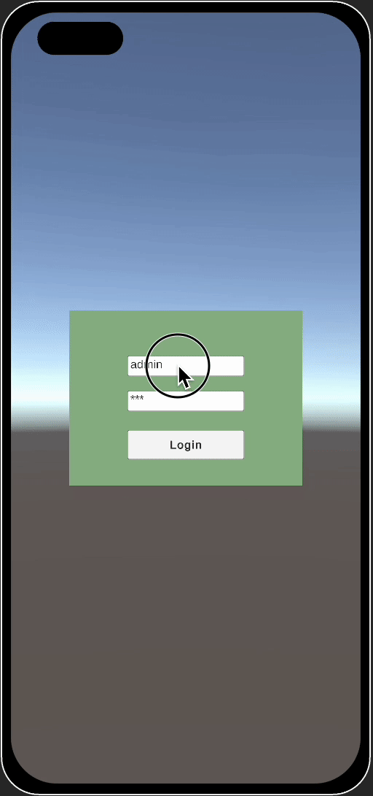
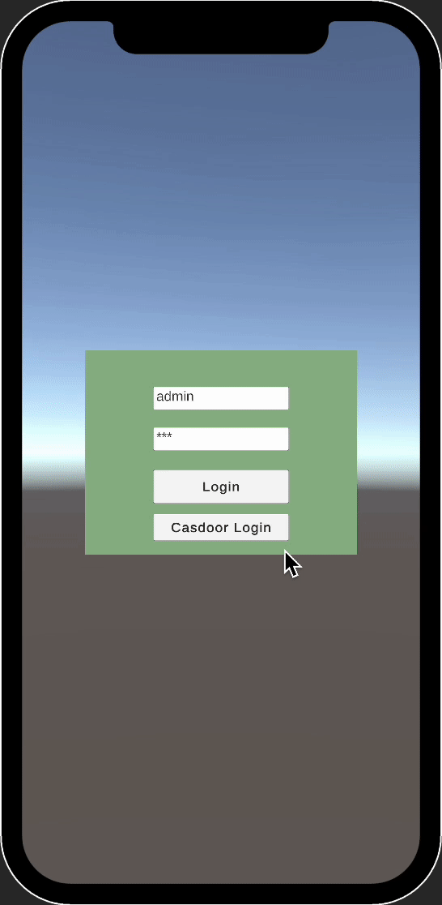
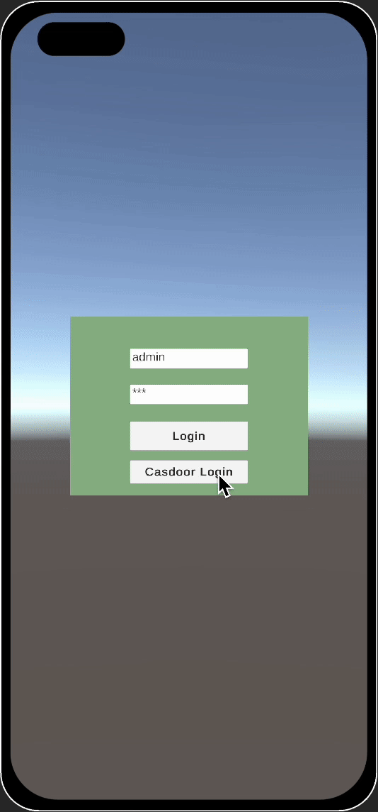

# Casdoor Unity Example

[](https://github.com/casdoor/casdoor-unity-example/blob/master/LICENSE)
[](https://discord.gg/5rPsrAzK7S)

An example [Unity](https://unity.com/) game that signs players in with [Casdoor](https://casdoor.ai/) before starting, using `Casdoor.Client` of [casdoor-dotnet-sdk](https://github.com/casdoor-net/casdoor-dotnet-sdk). The game is based on [ValleyOfCubes_Unity3D](https://github.com/oussamabonnor1/ValleyOfCubes_Unity3D).

| Sign in with | iOS | Android |
|--------------|:---:|:-------:|
| Username and password |  |  |
| The Casdoor sign-in page |  |  |

## How it works

All of the sign-in is in [Assets/Scripts/CasdoorLoginManage.cs](Assets/Scripts/CasdoorLoginManage.cs):

- **Username and password**: `client.RequestPasswordTokenAsync(account, password)` gets the tokens with the OAuth 2.0 password grant (the application needs the **Password** grant type in Casdoor).
- **Casdoor sign-in page**: the page is shown in a web view ([unity-webview](https://github.com/gree/unity-webview)). After signing in, Casdoor redirects to `http://localhost:5000/callback?code=...`; the script reads the code from the web view and exchanges it with `client.RequestAuthorizationCodeTokenAsync()`.
- Either way, `client.ParseJwtToken()` verifies the access token with the keys of Casdoor and returns the user, whose name and avatar are shown before the `Main` scene of the game is loaded.

`Casdoor.Client` and its dependencies are in [Assets/_NET/net462](Assets/_NET/net462) as plain DLLs, because Unity doesn't use NuGet.

## Prerequisites

- [Unity](https://unity.com/download) 2022.3 (LTS), with the iOS or Android build support for building to a phone
- A Casdoor server. The example is preconfigured for the public demo server https://door.casdoor.com, so it runs as is. To use your own, see [Casdoor installation](https://casdoor.ai/docs/basic/server-installation).

## Configuration

Skip this section to try the example with the public demo server.

In your Casdoor, create (or reuse) an organization and an application, enable the **Password** grant type if you use the username and password sign-in, and add `http://localhost:5000/callback` to the application's **Redirect URLs**. Then fill in the `CasdoorOptions` at the top of `Start()` in [CasdoorLoginManage.cs](Assets/Scripts/CasdoorLoginManage.cs):

```csharp
var options = new CasdoorOptions
{
    Endpoint = "https://door.casdoor.com", // Casdoor server URL
    OrganizationName = "casbin", // organization of the application
    ApplicationName = "app-example", // name of the application
    ApplicationType = "native", // webapp, webapi or native
    ClientId = "b800a86702dd4d29ec4d", // client ID of the application
    ClientSecret = "1219843a8db4695155699be3a67f10796f2ec1d5", // client secret of the application
    CallbackPath = "/callback",
    RequireHttpsMetadata = true,
    Scope = "openid profile email"
};
```

A game shipped to players can't keep a client secret: anyone can extract it from the build. For a real game, prefer the sign-in page with the authorization code flow and PKCE (no client secret), as in [casdoor-dotnet-desktop-example](https://github.com/casdoor-net/casdoor-dotnet-desktop-example).

## Run

```shell
git clone https://github.com/casdoor/casdoor-unity-example
```

Open the folder in Unity Hub, open the login scene and press **Play**, or build it to iOS or Android. On the demo server, sign in with username `admin` and password `123`.

## Resources

- [Casdoor documentation](https://casdoor.ai/docs/overview)
- [casdoor-dotnet-sdk](https://github.com/casdoor-net/casdoor-dotnet-sdk)

## License

[Apache-2.0](LICENSE)
