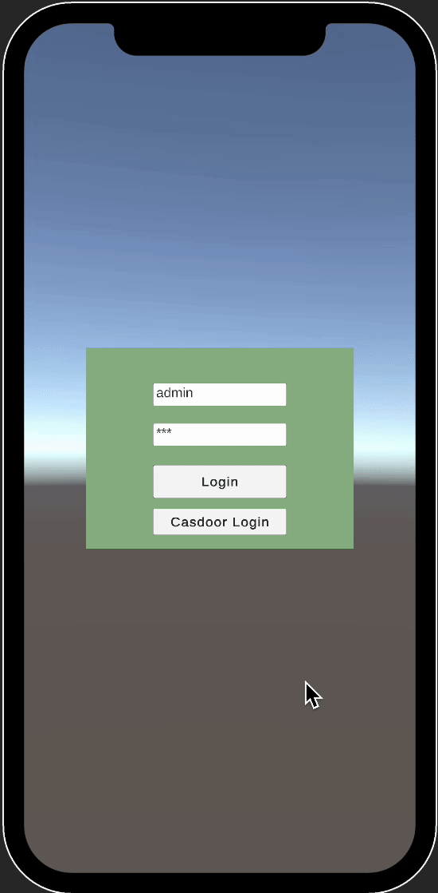
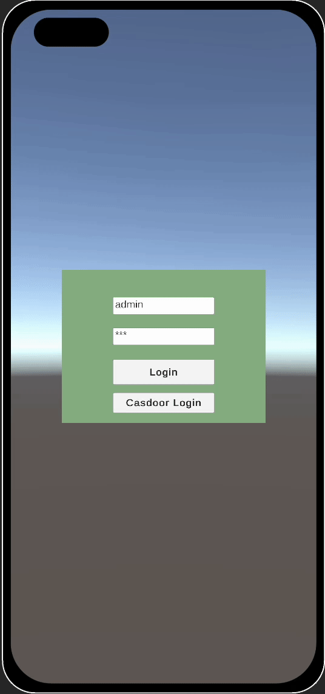

# casdoor-unity-example

The example uses the [Casdoor demo site](https://door.casdoor.com/) server and [`Casdoor.Client`](https://github.com/casdoor/casdoor-dotnet-sdk/tree/master/src/Casdoor.Client) SDK for `.NET` in [casdoor-dotnet-sdk](https://github.com/casdoor/casdoor-dotnet-sdk/). 

The game in this example is based on [ValleyOfCubes_Unity3D](https://github.com/oussamabonnor1/ValleyOfCubes_Unity3D).

## Quick Start

- download the code

```bash
 git clone git@github.com:casdoor/casdoor-unity-example.git
```

- Open the newly downloaded code in `Unity Hub` and run it.

## After running, you will see the following  interfaces:

### Login with username and password

|                           **iOS**                           |                         **Android**                          |
| :---------------------------------------------------------: | :----------------------------------------------------------: |
|  |  |

### Login with the casdoor web page

|                           **iOS**                            |                         **Android**                          |
| :----------------------------------------------------------: | :----------------------------------------------------------: |
|  |  |

## Configure

Initialization requires 6 parameters, which are all str type:
| Name (in order)  | Must | Description                                            |
| ---------------- | ---- | ------------------------------------------------------ |
| Endpoint         | Yes  | Casdoor Server Url, such as `https://door.casdoor.com` |
| OrganizationName | Yes  | Organization name                                      |
| ApplicationName  | Yes  | Application name                                       |
| ApplicationType  | Yes  | webapp, webapi or native                               |
| ClientId         | Yes  | Your client id                                         |
| ClientSecret     | Yes  | Your client secret                                     |

```C#
var httpClient = new HttpClient();
var client = new CasdoorClient(HttpClient, new CasdoorOptions{
    Endpoint = "https://door.casdoor.com",
    OrganizationName = "build-in",
    ApplicationName = "app-build-in",
    ApplicationType = "native", // webapp, webapi or native
    ClientId = "<your client id>",
    ClientSecret = "<your client secret>",
});
```

## License

This project is licensed under the [Apache 2.0 license](https://github.com/casdoor/casdoor-dotnet-sdk/blob/master/LICENSE).
